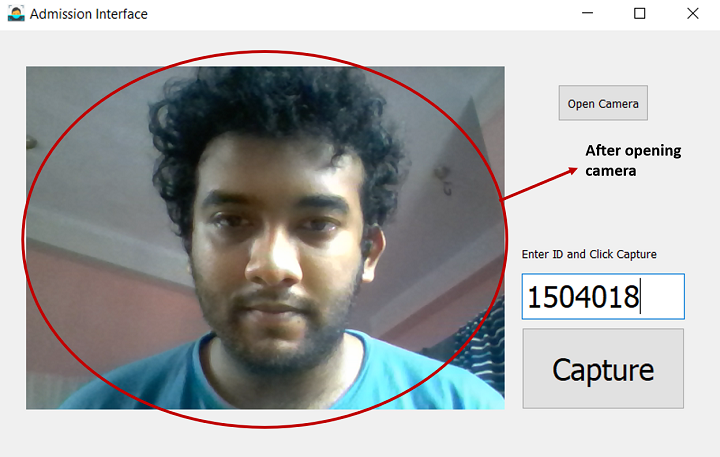
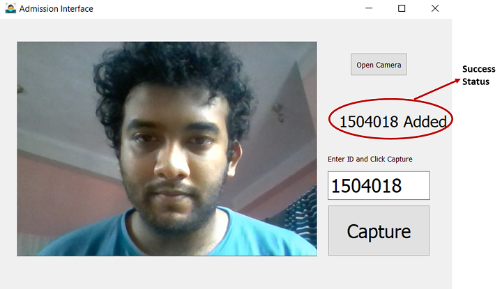
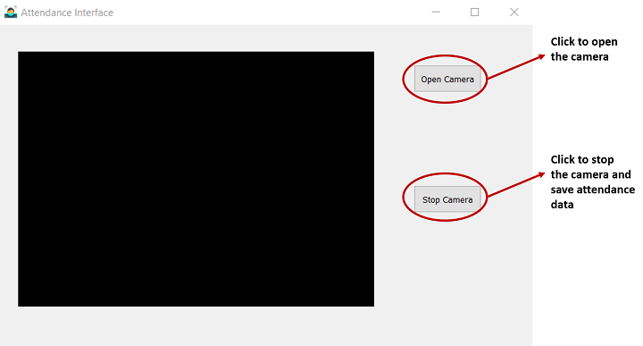
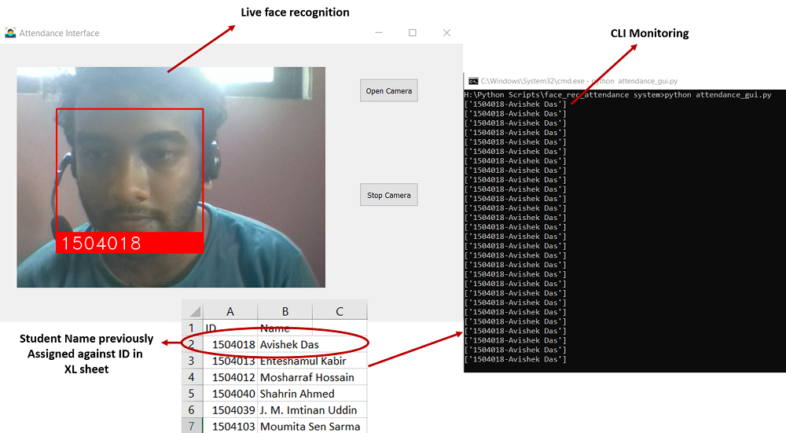
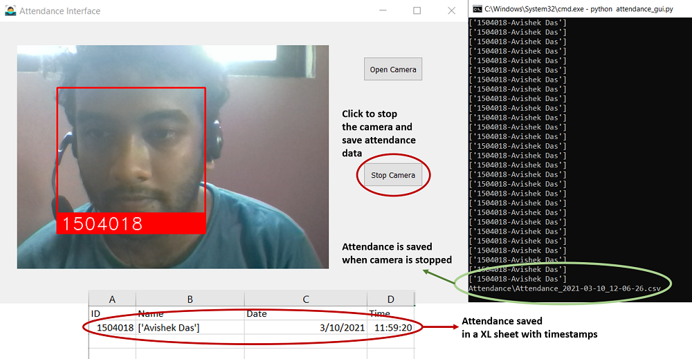

# IOT Based Face Recognition Attendance System

## Goals and Objectives of the project
There may be two types of implementation.
- Student will be sitted to their seat on classroom & a HD camera can recognize all
the students at once and give them attendance per class.
- Attendance will be given as students enter the door of the classroom so that we can
track when one comes in and goes out(suitable to track student activities). As there
are CC Cameras installed in our facility, we may implement on cc tv footage.

### GUI design

In the IOT based Face Recognition Attendance System, the user interface has been created
using PyQT5, a python-based desktop/mobile framework. It allows the users to interact
with the backend model. It has certain features:
- Open Camera
- Get students’ Information
- Capture new students face
- Recognize the faces while showing live video feed
- Generate attendance sheet

## Admission Interface
Run the admission_gui.py

## Attendance Interface
Run the attendance_gui.py

